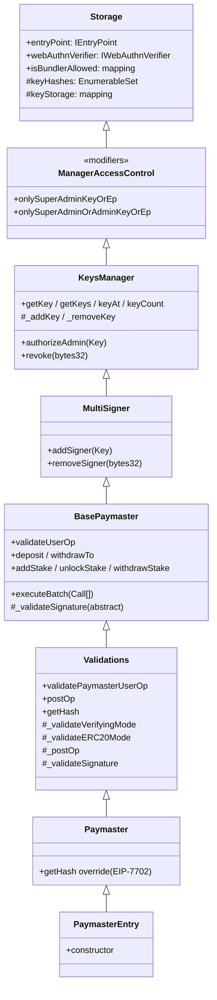
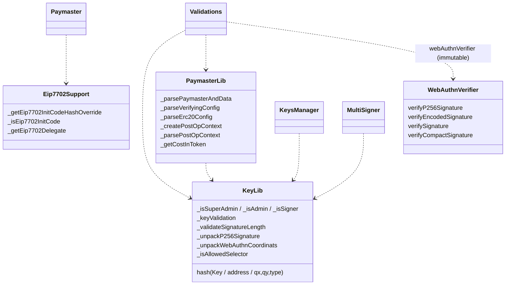

# 01 — Architecture

## Inheritance graph

The deployed contract is `PaymasterEntry`. It inherits a linear stack of abstract contracts, each adding one concern.

## Per-layer responsibility

| Layer | File | What it owns |
|-------|------|--------------|
| `Storage` | `core/Storage.sol` | Immutable bindings (`entryPoint`, `webAuthnVerifier`), key set + encoded key map, bundler allowlist. |
| `ManagerAccessControl` | `core/ManagerAccessControl.sol` | The two gating modifiers. Treats `msg.sender == entryPoint` and `msg.sender == address(this)` (self-call via `executeBatch`) as authorized. |
| `KeysManager` | `core/KeysManager.sol` | Add admin keys, revoke any key, enumerate keys, read-back the packed key encoding. |
| `MultiSigner` | `core/MultiSigner.sol` | Add/remove signer keys. Removal of admin/superAdmin via `removeSigner` is blocked (`KillSwitch`); only `revoke` can remove them. |
| `BasePaymaster` | `core/BasePaymaster.sol` | EntryPoint-facing surface for the paymaster *as an account*: `validateUserOp`, deposit/stake operations, `executeBatch`. |
| `Validations` | `core/Validations.sol` | EntryPoint-facing surface for the paymaster *as a paymaster*: `validatePaymasterUserOp`, `postOp`, the per-mode validators, `getHash`, and the account-level `_validateSignature` override. |
| `Paymaster` | `core/Paymaster.sol` | Wraps `getHash` to mix in the EIP-7702 delegation override. |
| `PaymasterEntry` | `core/PaymasterEntry.sol` | Constructor: validates initial keys, populates the bundler allowlist, binds EntryPoint and verifier. |

## Library dependencies

`WebAuthnVerifier` lives in `contracts/utils/` and is deployed as a standalone contract. The paymaster stores its address in the `webAuthnVerifier` immutable.

## Two EntryPoint-facing surfaces

The paymaster is dual-role:

- As an **account** — `validateUserOp` is called when a userOp is sent *from* this contract (e.g. an admin batches `deposit()` through `executeBatch`).
- As a **paymaster** — `validatePaymasterUserOp` / `postOp` are called when this contract appears in another userOp's `paymasterAndData`.

The two flows have separate signature-validation paths in `Validations`:
- `_validateSignature` (account path) — only superAdmin and admin keys may sign; signer keys are rejected. Admin keys are further constrained to a selector whitelist.
- `_validateVerifyingMode` / `_validateERC20Mode` (paymaster path) — only signer keys (and any non-expired key with `_isSigner() == true`) may sign sponsorships.
