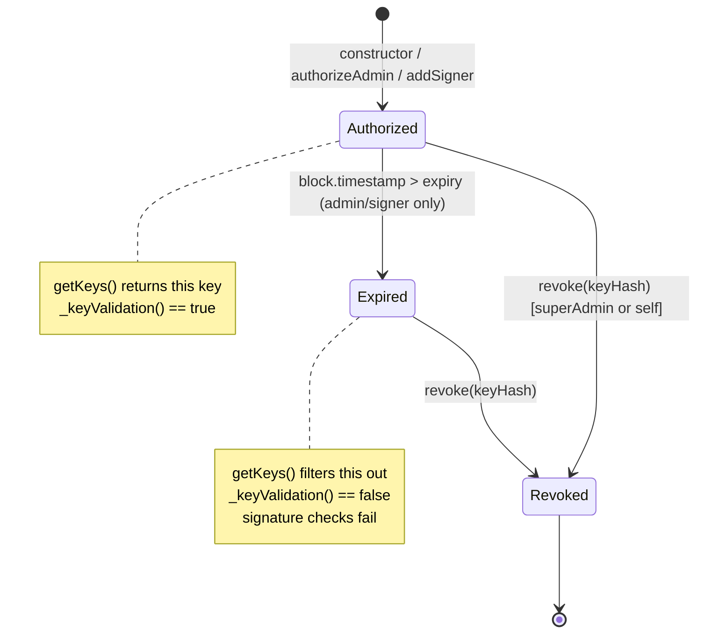

# 02 — Keys and Roles

The paymaster authorizes everything through `Key` structs registered onchain. There are three roles and three cryptographic key types; the role flags are part of the key itself, fixed at registration.

## The `Key` struct

Defined in `contracts/type/Types.sol`:

```solidity
struct Key {
    uint40   expiry;        // unix seconds; type(uint40).max for superAdmin
    SignerType keyType;     // P256 | WebAuthnP256 | Secp256k1
    bool     isSuperAdmin;
    bool     isAdmin;
    bytes    publicKey;     // abi.encode(address) for Secp256k1, abi.encode(qx,qy) for P256/WebAuthn
}
```

## Roles

A key's role is determined by `(isSuperAdmin, isAdmin, expiry)`. Validation lives in `library/KeyLib.sol`:

| Role | `isSuperAdmin` | `isAdmin` | `expiry` | What it can do |
|------|---------------|-----------|----------|----------------|
| **superAdmin** | `true` | `false` | `type(uint40).max` (never expires) | Everything: `authorizeAdmin`, `revoke`, `addSigner`, `removeSigner`, `withdrawTo`, `withdrawStake`, `deposit`, `addStake`, `unlockStake`. May sign account-level userOps unconditionally. |
| **admin** | `false` | `true` | finite | `addSigner`, `deposit`, `addStake`, `unlockStake`. May sign account-level userOps only for the whitelisted selectors below. |
| **signer** | `false` | `false` | finite | Only thing it can do: sign **paymaster sponsorships** (`validatePaymasterUserOp`). May not call any privileged paymaster function. |

The role checks (`_isSuperAdmin` / `_isAdmin` / `_isSigner` on `Key memory`) require *exact* flag combinations — a key cannot hold two roles at once.

### Admin selector whitelist

When an admin signs an account-level userOp, `_validateCallData` in `Validations.sol` requires the call's selector to be one of:

| Selector | Function |
|---------|----------|
| `0xd0e30db0` | `deposit()` |
| `0x0396cb60` | `addStake(uint32)` |
| `0xbb9fe6bf` | `unlockStake()` |
| `0x56864ab1` | `addSigner(Key)` |

Or it must be `executeBatch(Call[])` (`0x34fcd5be`) where every inner call's selector is whitelisted, **with one extra rule**: `approve(address,uint256)` is allowed iff its first argument equals `address(this)` (the paymaster). This lets an admin batch in token approvals back to the paymaster (used for ERC-20 mode pre-fund), but blocks approvals to anywhere else.

## Lifecycle



- **superAdmin and admin** are added via constructor (`PaymasterEntry`) or `authorizeAdmin` (only superAdmin can call).
- **signers** are added via `addSigner` (admin or superAdmin).
- **Removal**: `revoke(bytes32)` removes any key (superAdmin only). `removeSigner(bytes32)` is a safer wrapper that reverts with `KillSwitch` if the target key is admin/superAdmin — protecting against accidental loss of admin keys.
- **Expiry** is read at validation time. `getKeys()` skips keys where `expiry != 0 && block.timestamp > expiry`. `_keyValidation()` (per-key) returns false when expired.

## Storage

Keys are stored in two parallel structures (`Storage.sol`):

- `keyHashes` — an `EnumerableSet.Bytes32Set` for ordered enumeration.
- `keyStorage[keyHash]` — a `LibBytes.BytesStorage` holding the packed encoding `publicKey || expiry(5) || keyType(1) || isSuperAdmin(1) || isAdmin(1)`. The trailing bytes are read by inline `_isAdmin` / `_isSuperAdmin` checks in `KeyLib` without decoding the full struct.

`getKey(bytes32)` decodes the trailing 8 bytes to reconstruct the `Key` struct on demand.

## Key hashing

Hashes are computed by `KeyLib.hash` using `EfficientHashLib`:

```solidity
hash(Key)                = H(uint8(keyType), keccak256(publicKey))
hash(address)            = H(Secp256k1,      keccak256(abi.encode(address)))
hash(qx, qy, signerType) = H(uint8(signerType), keccak256(abi.encode(qx, qy)))
```

The signer type is part of the hash, so the same coordinates registered as `P256` and as `WebAuthnP256` produce different keys — preventing cross-type signature reuse.

## Authorization rules at a glance

| Action | Caller must be |
|--------|---------------|
| `authorizeAdmin(Key)` | superAdmin or EntryPoint or self |
| `revoke(bytes32)` | superAdmin or EntryPoint or self |
| `addSigner(Key)` | superAdmin / admin or EntryPoint or self |
| `removeSigner(bytes32)` | superAdmin or EntryPoint or self (rejects admin/superAdmin targets) |
| `deposit()`, `addStake`, `unlockStake` | superAdmin / admin or EntryPoint or self |
| `withdrawTo`, `withdrawStake` | superAdmin or EntryPoint or self |
| `executeBatch(Call[])` | EntryPoint only (called via `validateUserOp`) |

"or self" means the paymaster can call its own restricted functions when re-entered through `executeBatch`. "or EntryPoint" means the EntryPoint can act as if it were superAdmin (typical for v0.9 flows).

See [`INVARIANTS.md`](../INVARIANTS.md) at the repo root for the full invariant list.
