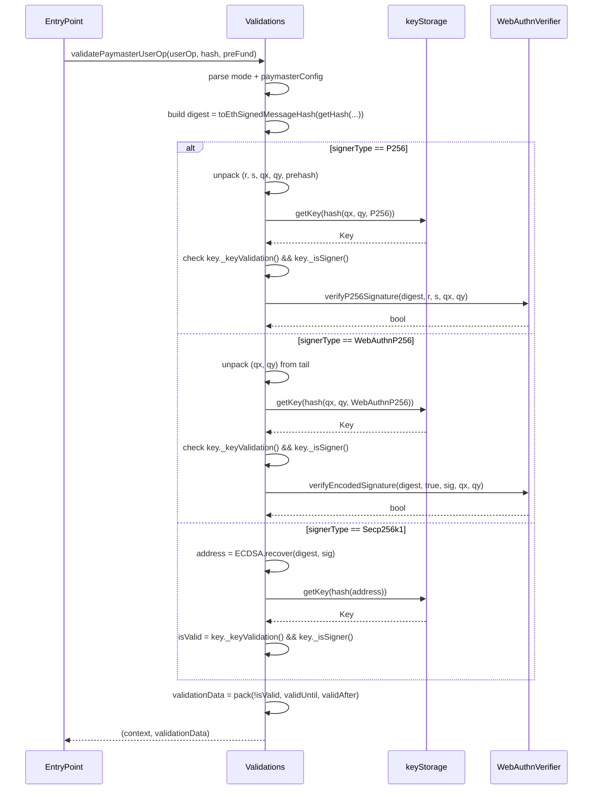

# 03 — Signature Schemes

Three signer types are supported, identified by `SignerType` (`type/Types.sol`):

| `signerType` | Enum | Public key encoding | Signature verifier |
|------|------|---------------------|---------------------|
| `0` | `P256` | `abi.encode(qx, qy)` (64 bytes) | `webAuthnVerifier.verifyP256Signature` |
| `1` | `WebAuthnP256` | `abi.encode(qx, qy)` (64 bytes) | `webAuthnVerifier.verifyEncodedSignature` |
| `2` | `Secp256k1` | `abi.encode(eoaAddress)` (32 bytes) | `ECDSA.recover` (OpenZeppelin) |

The `signerType` byte is part of `paymasterAndData` (paymaster path) or the first byte of `userOp.signature` (account path), so a userOp tells the paymaster which verifier to use.

## Signature layouts

Each verifier expects a specific byte layout. Length is enforced by `KeyLib._validateSignatureLength`.

### P256 — 128 or 129 bytes

```
┌────────┬────────┬────────┬────────┬────────────────────┐
│ r (32) │ s (32) │ qx(32) │ qy(32) │ prehash flag (0/1) │
└────────┴────────┴────────┴────────┴────────────────────┘
   0      32       64       96       128 (optional, 1 byte)
```

If the trailing byte is present and non-zero, the digest is **double-hashed** with SHA-256 before verification (used for non-extractable hardware keys that hash internally).

### WebAuthnP256 — variable, ≥ 352 bytes

```
abi.encode(WebAuthnAuth { authenticatorData, clientDataJSON, challengeIndex, typeIndex, r, s })
‖ qx (32) ‖ qy (32)
```

The auth struct is dynamically sized; `_validateSignatureLength` walks the embedded length words for `authenticatorData` and `clientDataJSON`, padding each to the next 32-byte boundary, and requires the total length to equal `0x160 + adPad + cjPad`. The verifier (`WebAuthnVerifier.verifyEncodedSignature`) decodes the struct and calls Solady's WebAuthn library, which checks the challenge and type fields inside `clientDataJSON` and verifies the embedded P256 signature.

### Secp256k1 — 64 or 65 bytes

Standard `r ‖ s` (64) or `r ‖ s ‖ v` (65). Verified with `ECDSA.recover(hash, sig)`; the recovered address is hashed via `KeyLib.hash(address)` and looked up in `keyStorage`.

## Verification flow (paymaster path)

`Validations._validateVerifyingMode` and `_validateERC20Mode` share the same dispatch:



**Order matters**: the key lookup happens *before* the cryptographic check. If the key is not registered, not a signer, or expired, `isSignatureValid` stays `false` and the cryptographic call is skipped — this avoids spending verification gas on unauthorized keys.

## Account-path verification

When the paymaster contract itself is the userOp sender (e.g. `executeBatch` flow), `_validateSignature` (in `Validations.sol`) is called instead. The first byte of `userOp.signature` is the `signerType`, and the remaining bytes follow the same layout as above.

Differences from the paymaster path:

- **Signer keys are explicitly rejected** (`if (key._isSigner()) return SIG_VALIDATION_FAILED`). Only superAdmin and admin keys may sign account ops.
- **superAdmin signatures pass with no callData check.**
- **Admin signatures additionally require** `_validateCallData(userOp.callData) == true` — the selector must be in the admin whitelist (see [02-keys-and-roles.md](./02-keys-and-roles.md)).
- **P256 (raw) is not supported** for the account path: the case returns `SIG_VALIDATION_FAILED` immediately. Only `WebAuthnP256` and `Secp256k1` are usable for account ops.

## Key takeaways

- `signerType` is mixed into the key hash, so the same coordinates registered as different types are distinct keys.
- The WebAuthn signature length validator does proper overflow guards on the embedded length fields — invalid offsets revert with `PaymasterSignatureLengthInvalid` (selector `0xf95eeeac`).
- The P256 prehash flag enables hardware keys that double-hash; it does not affect the key lookup.
