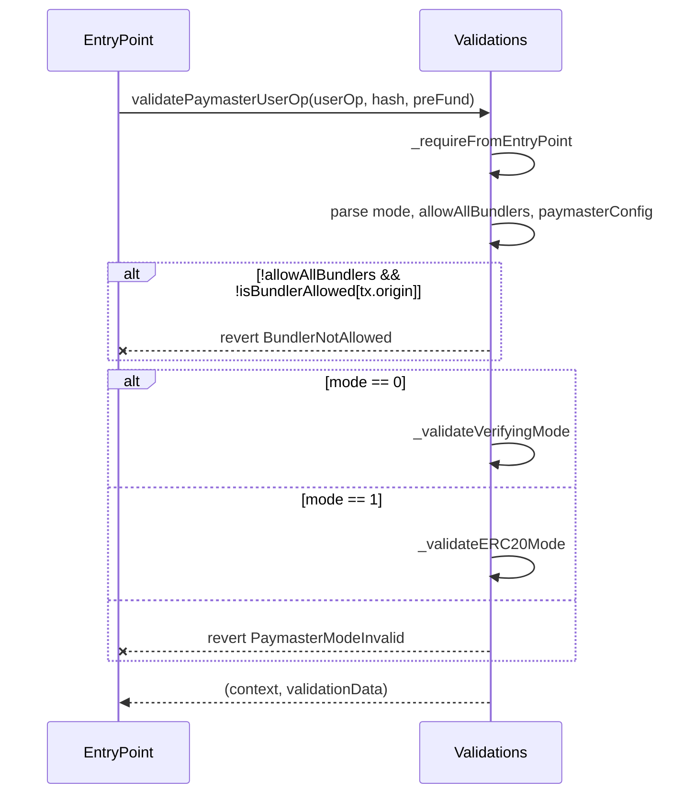
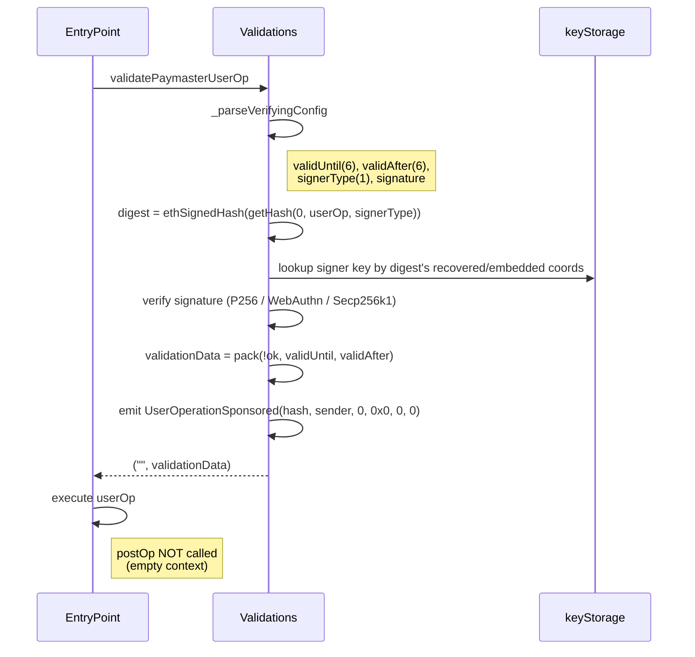
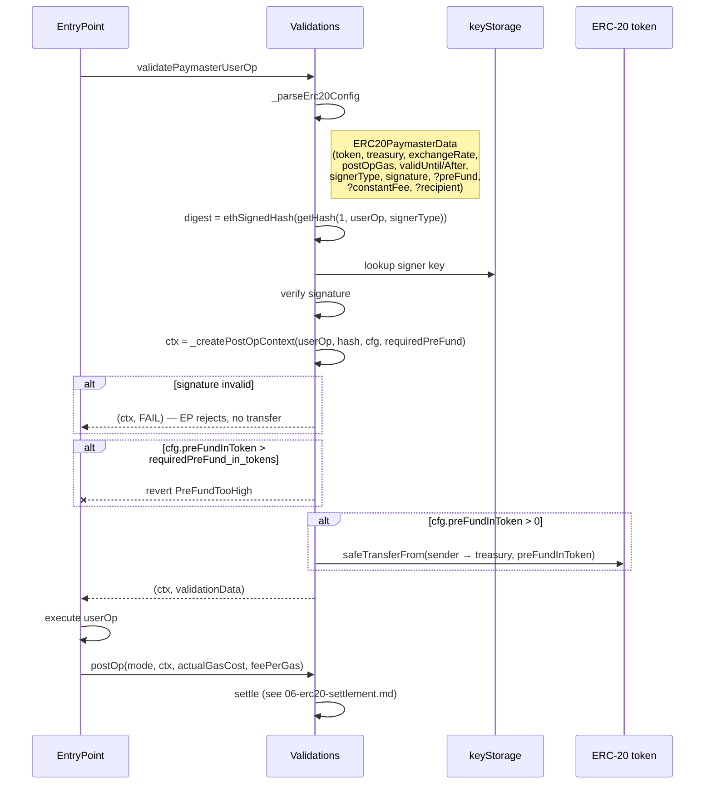

# 04 — Paymaster Modes

The paymaster has two operating modes selected per-userOp by the `mode` byte in `paymasterAndData`. Both flow through `Validations.validatePaymasterUserOp`.

## The mode byte

The first byte of the paymaster-specific section of `paymasterAndData` packs two things:

```
bit 7 6 5 4 3 2 1 0
    └─────┬─────┘ │
          │       └── allowAllBundlers (1 = skip allowlist check)
          └────────── mode (0 = verifying, 1 = ERC-20)
```

Parsed by `PaymasterLib._parsePaymasterAndData`:

```solidity
uint8 combinedByte    = uint8(paymasterAndData[PAYMASTER_DATA_OFFSET]);
bool  allowAllBundlers = (combinedByte & 0x01) != 0;
uint8 mode             = combinedByte >> 1;
```

Any `mode` other than `0` or `1` reverts with `PaymasterModeInvalid`.

## Common entry path



## Verifying mode (mode = 0)

Pure gas sponsorship. The signer authorizes the userOp with a (validUntil, validAfter, signerType, signature) blob. No tokens are involved; `postOp` is **not** called (context is empty).

### Flow



### What it costs

- One signature verification.
- One `getKey` storage read.
- One `UserOperationSponsored` event.

No token transfers, no postOp gas overhead.

## ERC-20 mode (mode = 1)

The user pays for gas in an ERC-20 token. The paymaster optionally collects a token pre-fund up front (during validation), then settles the actual cost in `postOp` after execution.

### Flow



### Required vs optional config

The config has eight required fields and three optional ones, controlled by bit flags in the first byte of the paymaster-config section. Full byte layout in [05-paymasterAndData-encoding.md](./05-paymasterAndData-encoding.md).

| Field | Status | Purpose |
|-------|--------|---------|
| `validUntil`, `validAfter` | required | Time bounds for the sponsorship. |
| `token` | required | ERC-20 used for payment. |
| `postOpGas` | required | Gas overhead the paymaster reserves for `postOp`. |
| `exchangeRate` | required | 18-decimal token-per-wei price. |
| `paymasterValidationGasLimit` | required | Used in `preOpGasApproximation` for penalty calculation. |
| `treasury` | required | Where the user's tokens are sent. |
| `preFundInToken` | optional | If > 0, charged via `safeTransferFrom` during validation. |
| `constantFee` | optional | Flat fee added to the actual gas cost in `postOp`. |
| `recipient` | optional | If set, surplus pre-fund (when actual cost ended up lower) is forwarded here. |

If `signature` is valid but `preFundInToken > requiredPreFund` (priced in tokens via `_getCostInToken`), validation reverts with `PreFundTooHigh` — the paymaster will not collect more up-front than the EntryPoint says is needed.

If the signature is invalid, validation still returns the postOp context but with a failure flag in `validationData`. The EntryPoint will reject the userOp and never call `postOp`, so no token transfer happens.

## Choosing a mode

| If you want to… | Mode |
|----|----|
| Sponsor gas for a specific userOp the user already paid for offchain | Verifying |
| Let the user pay for gas in USDC / a project token | ERC-20 |
| Add a flat protocol fee on top of gas | ERC-20 + `constantFee` |
| Refund leftover pre-fund to a third party (e.g. a relayer) | ERC-20 + `recipient` |

## Events

Both modes emit `UserOperationSponsored(userOpHash, sender, mode, token, tokenAmountPaid, exchangeRate)`. In verifying mode the last three fields are zero.
