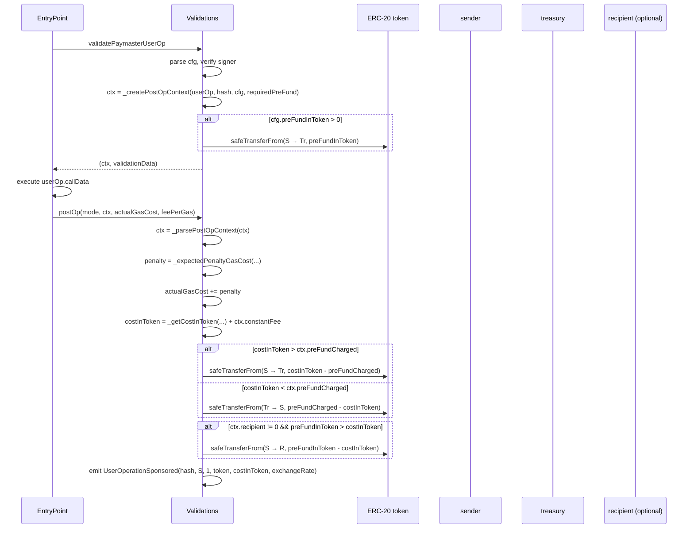

# 06 — ERC-20 Settlement

ERC-20 mode pays for gas in tokens. Payment splits into two phases:

1. **Validation phase** — `_validateERC20Mode` optionally collects a token **pre-fund** from the sender.
2. **Settlement phase** — `_postOp` reconciles the pre-fund against the actual gas cost (priced in tokens) and moves tokens accordingly.

## End-to-end sequence



## Pre-fund (validation)

Set in `paymasterAndData` as the optional `preFundInToken` (uint128). Constraints:

- Must not exceed the EntryPoint's required pre-fund priced in tokens — `preFundInToken > _getCostInToken(requiredPreFund, 0, 0, exchangeRate)` reverts with `PreFundTooHigh`.
- Pulled with `SafeTransferLib.safeTransferFrom(token, sender, treasury, preFundInToken)`. The sender must have approved at least this amount to the paymaster (or used the admin path to set the approval — see [02-keys-and-roles.md](./02-keys-and-roles.md)).
- If `preFundInToken == 0`, no transfer happens during validation; the entire cost is settled in `postOp`.

## Cost conversion (`_getCostInToken`)

```solidity
function _getCostInToken(
    uint256 actualGasCost,        // wei spent on gas
    uint256 postOpGas,            // gas reserved for postOp
    uint256 actualUserOpFeePerGas,
    uint256 exchangeRate          // 18-decimal token-per-wei
) returns (uint256) {
    return ((actualGasCost + (postOpGas * actualUserOpFeePerGas)) * exchangeRate) / 1e18;
}
```

Adds the postOp gas overhead at the actual fee per gas, then scales by `exchangeRate / 1e18`. `exchangeRate` must encode the price of 1 wei in token-base-units, scaled by `1e18`. (For a token-per-wei ratio `r`, `exchangeRate = r * 1e18`.)

## Penalty gas (`_expectedPenaltyGasCost`)

ERC-4337 charges paymasters a 10% penalty on **unused** execution gas to discourage inflated `callGasLimit`. The paymaster computes this itself in `postOp` and adds it to the actual cost charged to the user:

```
actualGas        = actualGasCost / feePerGas + postOpGas
executionGasUsed = max(0, actualGas - preOpGasApproximation)

if executionGasLimit > executionGasUsed:
    penaltyGas = (executionGasLimit - executionGasUsed) * 10 / 100
else:
    penaltyGas = 0

penaltyGasCost = penaltyGas * feePerGas
```

Where:
- `executionGasLimit = userOp.callGasLimit + userOp.postOpGasLimit` (set in `_createPostOpContext`).
- `preOpGasApproximation = userOp.preVerificationGas + userOp.verificationGasLimit + paymasterValidationGasLimit` (also set at validation time).

`PENALTY_PERCENT` is `10` (`type/Types.sol`).

## Settlement transfer (`_postOp`)

Algorithm:

```
costInToken = _getCostInToken(actualGasCost + penaltyGasCost,
                              postOpGas, feePerGas, exchangeRate)
            + constantFee

delta = |costInToken - preFundCharged|

if costInToken > preFundCharged:
    transferFrom(token, sender, treasury, delta)        // user owes more
else:
    transferFrom(token, treasury, sender, delta)        // refund

# Recipient surplus
preFundInToken = (preFund * exchangeRate) / 1e18         # EntryPoint preFund in tokens
if recipient != 0 and preFundInToken > costInToken:
    transferFrom(token, sender, recipient, preFundInToken - costInToken)
```

Notes:

- **Sender approvals**: the sender must have approved the paymaster for *at least* `preFundInToken + max(0, costInToken - preFundCharged) + max(0, preFundInToken - costInToken)`. In practice this is bounded by `preFundInToken` plus a buffer.
- **Treasury approvals**: when refunding, the **treasury** must have approved the paymaster as a spender on its own token balance — refunds use `transferFrom(treasury, sender, …)`. This is intentional: the treasury should be a smart contract or an account that pre-approves the paymaster.
- **Recipient surplus** is funded *from the sender*, not from the treasury — if the actual cost ends up below the EntryPoint's `requiredPreFund` priced in tokens, the difference is forwarded to `recipient`.
- The `mode` argument (`PostOpMode`) is ignored by `_postOp` — settlement runs identically whether the userOp succeeded or reverted, since the EntryPoint already collected the gas cost.

## ERC20PostOpContext

Built by `PaymasterLib._createPostOpContext` and ABI-encoded in the bytes returned to the EntryPoint. Decoded in `_postOp`. Carries everything needed for settlement without re-reading the userOp:

| Field | Purpose |
|-------|---------|
| `sender`, `token`, `treasury`, `recipient` | Transfer endpoints |
| `exchangeRate`, `postOpGas`, `constantFee` | Pricing inputs |
| `preFund`, `preFundCharged` | EntryPoint's required pre-fund vs what we already collected |
| `executionGasLimit`, `preOpGasApproximation` | Penalty calculation inputs |
| `userOpHash` | For the settlement event |
| `maxFeePerGas`, `maxPriorityFeePerGas` | Reserved (v0.6 fields, currently unused — set to 0) |

## Failure modes

- Signer invalid → `_validateERC20Mode` returns `(context, FAIL)`. EntryPoint rejects, no transfers, no `postOp`.
- `preFundInToken` exceeds priced `requiredPreFund` → revert `PreFundTooHigh` during validation.
- Sender lacks token allowance for `preFundInToken` → `SafeTransferLib` reverts during validation.
- Sender lacks allowance for the settlement delta → `_postOp` reverts. Per ERC-4337 the EntryPoint will retry `postOp` once with `postOpReverted` mode; the same code path runs, so a persistent allowance shortfall ultimately fails the userOp.
