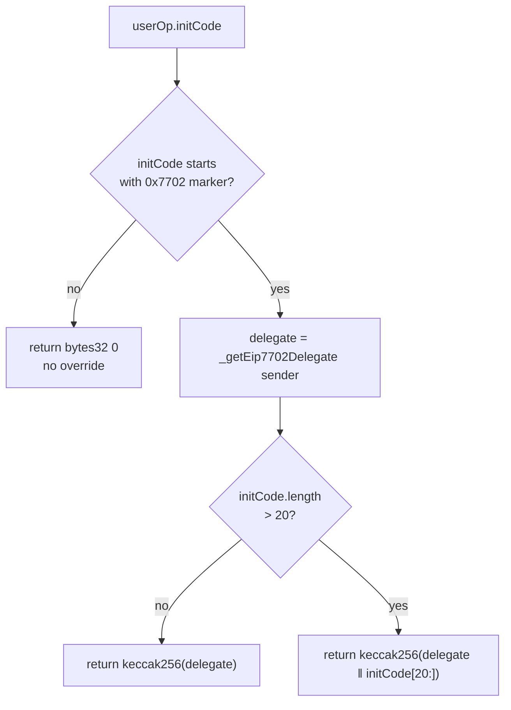

# 07 — EIP-7702 Support

EIP-7702 lets an EOA install delegation code so that calls to the EOA execute target-contract logic. From the paymaster's perspective the issue is: the userOp `sender` is an EOA address, but its behavior is determined by the **delegation target**, which can change. The paymaster must not authorize a userOp without binding the signer's authorization to the specific delegation target in effect.

## What `Paymaster.getHash` does

`Validations.getHash` (in the parent layer) hashes the static userOp fields. `Paymaster.getHash` (`core/Paymaster.sol`) wraps it:

```solidity
function getHash(uint8 mode, PackedUserOperation calldata userOp, SignerType st)
    public view override returns (bytes32)
{
    bytes32 overrideInitCodeHash = Eip7702Support._getEip7702InitCodeHashOverride(userOp);
    bytes32 originalHash         = super.getHash(mode, userOp, st);
    return keccak256(abi.encode(originalHash, overrideInitCodeHash));
}
```

For non-7702 userOps `overrideInitCodeHash == bytes32(0)`, so the wrapping is a deterministic but transparent extra hash. For 7702 userOps it carries the delegation target into the digest the signer must sign.

## How the override is computed

`Eip7702Support._getEip7702InitCodeHashOverride`:



### Marker detection (`_isEip7702InitCode`)

The function reads the first 32 bytes of `initCode` (calldata-relative) and compares the leading 2 bytes against `INITCODE_EIP7702_MARKER = 0x7702`. The bundler signals a 7702 userOp by putting this marker at the start of `initCode`. `initCode.length < 2` or any other prefix means "not 7702" and the override returns zero.

### Delegate resolution (`_getEip7702Delegate`)

Reads the first 23 bytes of `_sender`'s onchain code via `extcodecopy`. EIP-7702 delegation code has the layout `0xef0100 || delegationTarget(20)`:

- If those 23 bytes do not start with `EIP7702_PREFIX = 0xef0100`, revert:
  - `SenderHasNoCode` if the sender has no code at all,
  - `NotEIP7702Delegate` otherwise.
- Otherwise return the trailing 20 bytes as `address`.

## Why this design

The signer is signing off-chain on a digest that includes the *current* delegation target. If the EOA re-delegates to a different contract before the userOp is mined, the paymaster's `getHash` will return a different digest, the signature won't match, and `validatePaymasterUserOp` returns `SIG_VALIDATION_FAILED`. The signer's authorization is therefore tied to a specific target contract, not just to an EOA address — without this, an attacker who controls the EOA could re-delegate to a malicious contract after obtaining a sponsorship.

## What signers must do

When producing a paymaster signature for an EIP-7702 userOp:

1. Resolve the EOA's current delegation target (e.g. `eth_getCode(sender)` and parse the `0xef0100 || target` prefix).
2. Call `paymaster.getHash(mode, userOp, signerType)` off-chain — it will include the override automatically.
3. Sign the resulting digest as usual.

For non-7702 userOps the override is zero and `getHash` behaves identically to the base implementation.

## Edge cases

- `initCode` shorter than 20 bytes after the `0x7702` marker → the override is `keccak256(delegate)` (the trailing tail is empty).
- `initCode` longer than 20 bytes → the override is `keccak256(delegate ‖ initCode[20:])`. The trailing bytes are typically a calldata payload the bundler wants to forward to the delegated account on first use.
- The detection only triggers on the **`initCode` marker**, not on the bare presence of `0xef0100` in the sender's bytecode. A sender already delegated (no marker in `initCode`) is treated as a normal account by the paymaster — the override is zero. This matches the bundler convention of using the marker only when the EOA needs first-time setup or proof of delegation.
