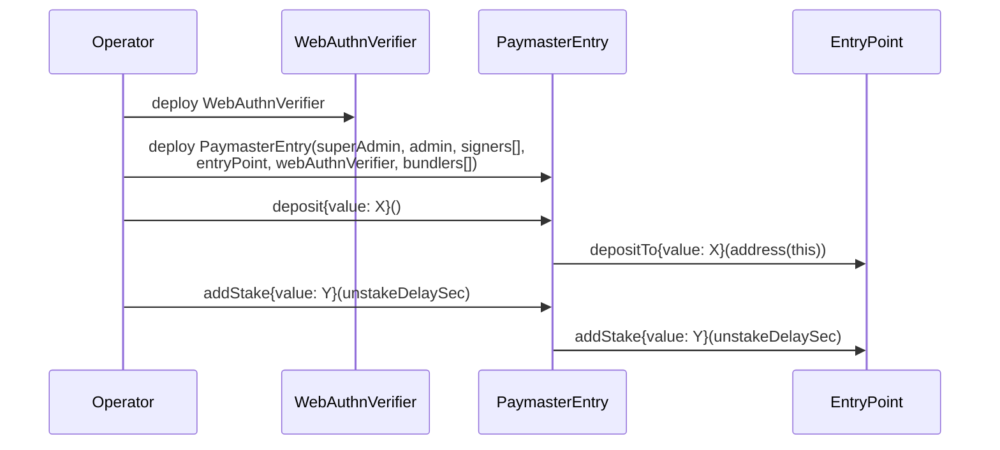
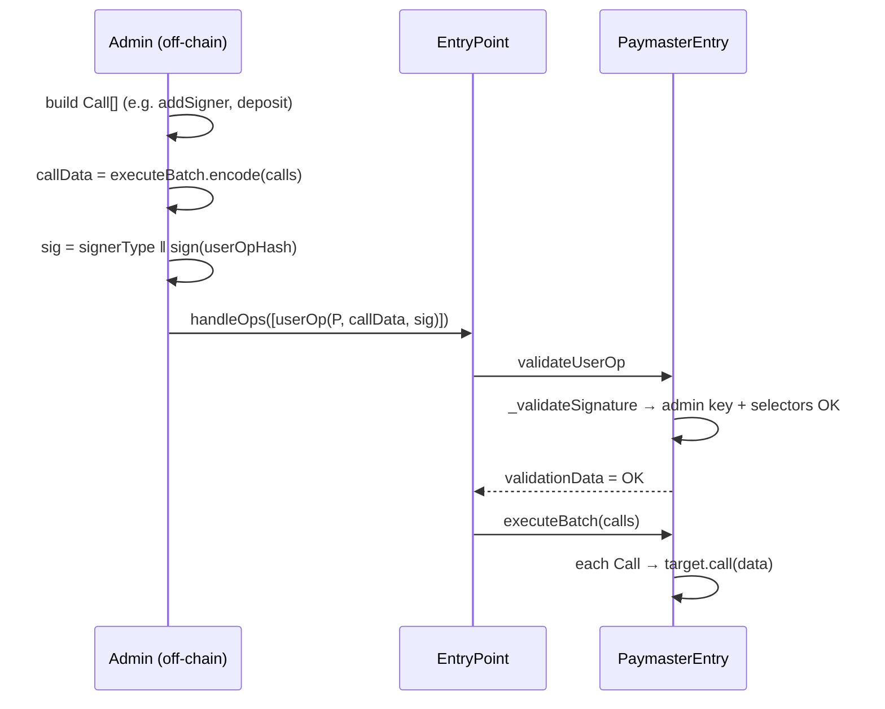

# 09 — Deployment and Integration

This doc covers the steps to deploy `PaymasterEntry`, fund it, register signers, and consume sponsorships from a wallet/bundler.

## Constructor

```solidity
constructor(
    Key memory          _superAdmin,
    Key memory          _admin,
    Key[] memory        _signers,
    IEntryPoint         _entryPoint,
    IWebAuthnVerifier   _webAuthnVerifier,
    address[] memory    _allowedBundlers
)
```

Each parameter has hard requirements (`PaymasterEntry.constructor`):

| Param | Requirements |
|-------|--------------|
| `_superAdmin` | `_isSuperAdmin()`: `isSuperAdmin == true`, `isAdmin == false`, `keyType >= P256+1` (i.e. not zero-uninit), `expiry == type(uint40).max`, non-empty `publicKey`. |
| `_admin` | `_isAdmin()`: `isAdmin == true`, `isSuperAdmin == false`, `keyType` valid, `expiry != type(uint40).max`, non-empty `publicKey`. |
| `_signers[i]` | `_isSigner()`: `isSuperAdmin == false`, `isAdmin == false`, `expiry != type(uint40).max`, non-empty `publicKey`. |
| `_entryPoint` | non-zero |
| `_webAuthnVerifier` | non-zero — typically the `WebAuthnVerifier` from `contracts/utils/`, deployed separately |
| `_allowedBundlers[i]` | non-zero (zero address reverts) |

A failure in any of these reverts the deployment. `_entryPoint` and `_webAuthnVerifier` are written to immutables; the rest populates `keyStorage`/`keyHashes`/`isBundlerAllowed`.

## Deploy sequence



## Funding the paymaster

`BasePaymaster` exposes the EntryPoint deposit/stake passthroughs:

| Function | Caller | Forwards to EntryPoint as |
|----------|--------|---------------------------|
| `deposit() payable` | superAdmin / admin / EP / self | `depositTo{value}(address(this))` |
| `addStake(uint32 delay) payable` | superAdmin / admin / EP / self | `addStake{value}(delay)` |
| `withdrawTo(address, uint256)` | superAdmin / EP / self | `withdrawTo(addr, amount)` |
| `unlockStake()` | superAdmin / admin / EP / self | `unlockStake()` |
| `withdrawStake(address)` | superAdmin / EP / self | `withdrawStake(addr)` |
| `getDeposit()` | anyone | `balanceOf(address(this))` |

The admin path goes through `executeBatch` (see below) — admins cannot call these functions directly off-chain.

## Adding signers post-deploy

```solidity
paymaster.addSigner(Key({
    expiry:       <unix-seconds>,
    keyType:      SignerType.<P256 | WebAuthnP256 | Secp256k1>,
    isSuperAdmin: false,
    isAdmin:      false,
    publicKey:    <encoded as in 03-signature-schemes.md>
}));
```

Caller must hold a superAdmin or admin key (or be the EntryPoint, or be `address(this)` via `executeBatch`).

To remove a signer: `removeSigner(keyHash)` — superAdmin only. Reverts if the target key is admin or superAdmin (`KillSwitch`).

## The admin path: signing privileged operations as a userOp

Admin keys cannot call privileged paymaster functions directly. To use them off-chain, build a userOp **with the paymaster as the sender** and sign it with the admin key:

1. Construct a `Call[]` array of operations the admin wants to perform (`addSigner`, `deposit`, `addStake`, `unlockStake`, or `approve(address(paymaster), x)`).
2. Encode `executeBatch(calls)` as `userOp.callData`.
3. Set `userOp.signature = signerType ‖ adminSignature`.
4. Submit via the EntryPoint.

`Validations._validateSignature` recovers the admin key, runs `_validateCallData` over the `executeBatch` payload, and rejects the userOp unless every inner call's selector is in the whitelist (or is an `approve` with `address(this)` as the spender).



## Building `paymasterAndData` (the bundler/wallet side)

Pseudo-code for building a sponsored userOp in **verifying mode**:

```typescript
const paymasterAndDataPrefix =
    paymasterAddress                                      // 20 bytes
  + paymasterValidationGasLimit.padded(16)                // 16 bytes
  + paymasterPostOpGasLimit.padded(16);                   // 16 bytes (per ERC-4337 v0.7 packing)

const modeByte = (0 /* verifying */) << 1 | (allowAllBundlers ? 1 : 0);

const cfg =
    pad6(validUntil) + pad6(validAfter)
  + pad1(SignerType.Secp256k1);                           // pick one

const placeholderSig = "00".repeat(65);                   // signature length must match SignerType
const probeData = paymasterAndDataPrefix + hex(modeByte) + cfg + placeholderSig;

userOp.paymasterAndData = probeData;
const digest = await paymaster.getHash(0, userOp, SignerType.Secp256k1);
const sig    = signer.sign(toEthSignedMessageHash(digest));   // EIP-191
userOp.paymasterAndData = paymasterAndDataPrefix + hex(modeByte) + cfg + sig;
```

For **ERC-20 mode**, replace `cfg` with the layout from [05-paymasterAndData-encoding.md](./05-paymasterAndData-encoding.md), set the appropriate flag bits for any optional fields, and sign the `getHash(1, ...)` digest. The wallet must also approve `paymaster` on `token` before submitting.

## Verifier and EntryPoint references

- The paymaster is **bound** to one EntryPoint and one WebAuthnVerifier for life. Migrating to a new EntryPoint or verifier requires a redeploy.
- `WebAuthnVerifier` is in `contracts/utils/WebAuthnVerifier.sol`. It is a thin wrapper over Solady's WebAuthn / P256 libraries and is safe to share across multiple paymasters.

## Quick checklist for a new deployment

1. Decide superAdmin + admin key types and material; pick a non-zero finite admin expiry.
2. Decide which bundler EOAs (if any) get baked into the constructor allowlist.
3. Deploy `WebAuthnVerifier` once per chain (or reuse an existing deployment).
4. Deploy `PaymasterEntry` with the keys, EntryPoint, verifier, bundlers.
5. Call `deposit{value: x}()` from superAdmin/admin to fund gas sponsorship.
6. (Optional) Call `addStake{value: y}(unstakeDelaySec)` to register the paymaster with EP staking.
7. Add operational signer keys via `addSigner`.
8. Wire your bundler/relayer to call `getHash` and append signatures.

## Source map

| Topic | File |
|-------|------|
| Constructor | `contracts/core/PaymasterEntry.sol` |
| Deposit / stake | `contracts/core/BasePaymaster.sol` |
| Add / remove signer | `contracts/core/MultiSigner.sol` |
| Authorize / revoke admin | `contracts/core/KeysManager.sol` |
| Mode + signature dispatch | `contracts/core/Validations.sol` |
| `getHash` (with EIP-7702) | `contracts/core/Paymaster.sol` |
| `paymasterAndData` parsing | `contracts/library/PaymasterLib.sol` |
| Selector whitelist | `contracts/library/KeyLib.sol` |
